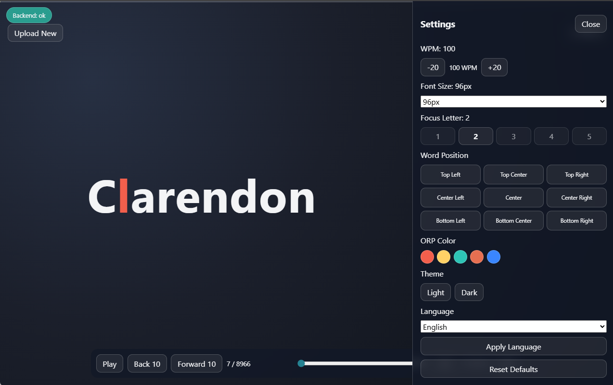

# RSVP Reader 📖




Help your kiddos with reading a book in an ease way? Look no further 🔥 Here I made an exectuable file that can help reading a book 📖. Read PDFs at high speed, one word at a time. Upload, set your pace, and focus.⚡

## Get the Executable! 🧰⬇️

Download the Windows executable [here](dist/). But if you want to build it yourself follow the [quick start](#Quick-Start) below. 

## Why It's Fun 😎✨

- Fast upload + instant parsing 🚀📄
- Smooth RSVP playback controls 🎛️▶️
- Keyboard shortcuts for flow ⌨️⚡
- Theme/language/pacing personalization 🎨🌍🧠

## Quick Start 🚀

### Local dev 🛠️

```powershell
python -m venv .venv
.\.venv\Scripts\Activate.ps1
pip install -r backend\requirements.txt
cd backend
uvicorn main:app --reload --host 0.0.0.0 --port 8000
```

In another terminal:

```powershell
cd frontend
npm install
npm run dev -- --host
```

### Docker 🐳

```powershell
docker compose -f docker-compose.yml -f docker-compose.dev.yml up --build
```

## Docs 📚

- [Setup Guide](docs/SETUP.md)
- [Docker Guide](docs/DOCKER.md)
- [Environment Variables](docs/ENVIRONMENT.md)
- [API Reference](docs/API.md)
- [Desktop Build & Release](docs/DESKTOP_BUILD.md)
- [Project Structure & Stack](docs/PROJECT_OVERVIEW.md)
- [Troubleshooting](docs/TROUBLESHOOTING.md)

## Testing Assets 🧪

Smoke-test sample PDFs and JSON payload snapshots are now organized in [testing/smoke](testing/smoke).


## License 🧾⚖️

Choose and add a license file (for example MIT) 🧾